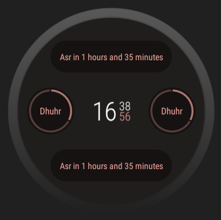
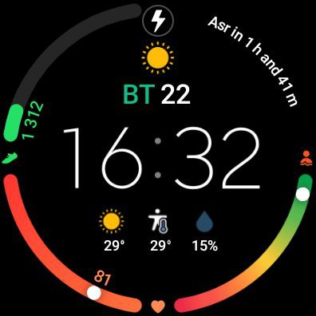
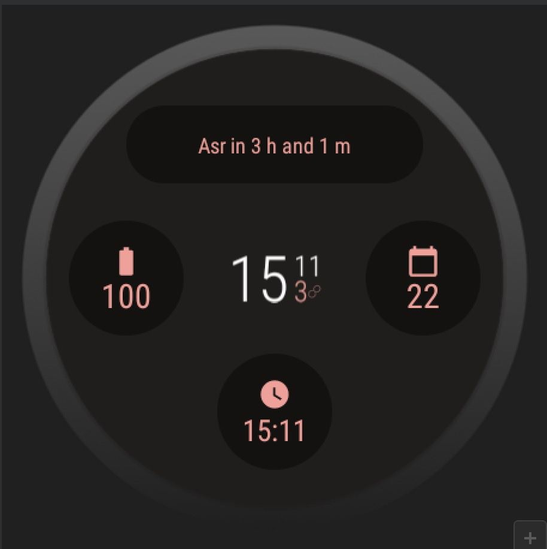

# NamazTime



**Complication for Wear OS showing the next Namaz/Prayer time**

## Introduction

NamazTime is a project that aims to provide a complication for Wear OS smartwatches to display the time left until the next Namaz/Prayer time. The project fetches prayer time data for Astana city from a specific year and calculates the time remaining for each prayer.

## Features

- Display the time left until the next Fajr, Dhuhr, Asr, Maghrib, or Isha prayer time.
- Support for Wear OS smartwatches.
- Fetch prayer time data from a specific year and location.

## Getting Started

Follow these steps to get started with the project:

1. Clone the repository:

```sh
git clone https://github.com/adntgv/NamazTime.git
```

2. Open the project in Android Studio.

3. Build and run the project on an emulator or Wear OS device.

## Screenshots

Here are some screenshots of the WearOSNamazComplication:




## Known Issues

- Limited to muftiyat.kz API

## Future Enhancements

- Add support for more countries and API's
- Provide customization options for users.
- ...

## Contributing

Contributions are welcome! If you find any issues or have suggestions for improvements, feel free to submit a pull request or open an issue.

---

*Note: This project is a personal exploration and demonstration. It may not accurately reflect real prayer time calculations or provide accurate data.*
